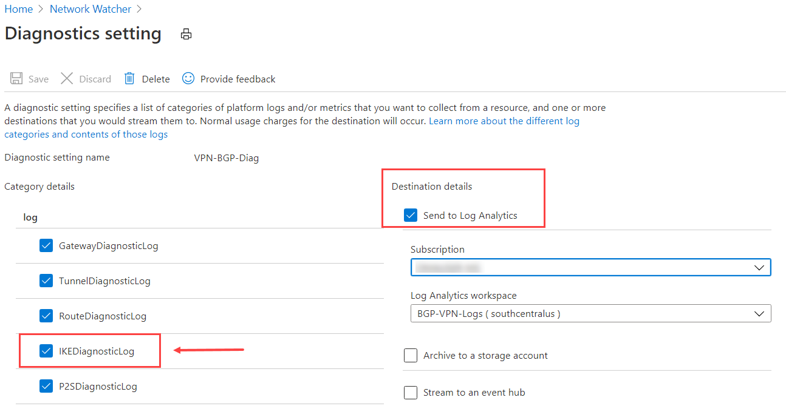

# Azure Virtual Network Gateway IKE Logs

## Introduction

Getting visibility on Azure components is key to better understand how they work and helps on the troubleshooting process. Internet Key Exchange (IKE) is the protocol used to set up security association (SA) in the IPSec protocol suite. For a full IPSec tunnel tunnel to be established and maintained, IKE has to succeed in both Phase I (Main Mode) and Phase II (Quick Mode). Therefore, IKE Logs is key to troubleshoot VPN connectivity issues or IP tunnel disconnections. In this article we going to go over how to enable those IKEv2 logs as well as go over few common scenarios to help you troubleshoot connectivity issues.

## Prerequisites

In order to enable IKE Logs for Virtual Network Gateway you need to send the logs to a storage account, log analytics or event hub (3rd party logging applications). That can be done over Azure Monitor via Powershell, CLI or Portal. Below is an on how to enable IKE Logs for Azure Virtual Network Gateway over Portal under Azure Monitor - Diagnostics - Select Resource Group and Virtual Network Gateway (also applicable for Azure Virtual WAN VPN Gateway):



For the scope of this article you have to select at least IKEDiagnosticLog.
More information on how to enable logs consult: [Diagnostic logs](https://docs.microsoft.com/en-us/azure/virtual-wan/logs-metrics#diagnostic)

## IKE logs kusto query

Below is a IKE Kusto query that can help extract information from IKEDiagnosticLog in Log Analytics. By default that Kusto query will list IKE logs from the last 30 minutes. 

```kusto
AzureDiagnostics 
| where Category == "IKEDiagnosticLog" 
| where TimeGenerated > ago(30m) 
// 1) Use Time range to look for issues on specific time range. Useful for finding root cause of IPSec connection issues.
//| where TimeGenerated >= datetime(2020-09-18 15:43) and TimeGenerated <= datetime(2020-09-18 15:45) // Set a time range.
| where Message contains "SESSION_ID"
| extend SessionID = extract("{(.*)}", 1, Message), RemoteIP = extract("Remote (.*?):", 1, Message), LocalIP = extract("Local (.*?):", 1, Message), IKEMessage = extract("Local .*00: (.*)", 1, Message), GWIN = extract("\\d",0,instance_s)
//| parse Message with "SESSION_ID :{" SESSION_ID "} Remote " Remote ":" RemotePort ": Local " Local ":" LocalPort ": [" Direction "]" Message
// 2) Narrow down to dump IKE events only for remote by specify remote VPN IP. It is useful for scenarios when VPN is connected has multiple S2S VPN Connections.
//| where RemoteIP == "104.215.122.58"
// 3) This is useful to filter on Active-Active Azure VPN GW Scenarios and Azure Virtual WAN
// | where GWIN == "0" // Filters Gateway Instance (GW_IN) 0 just change from 0 to 1 to filter second VPN Gateway instance
// 4) Narrow down to specific session ID
//| where SessionID == "F71C1B4E-17C2-4028-961B-AA1BED2E6C4D" 
| project TimeGenerated, GWIN, SessionID, RemoteIP, LocalIP, IKEMessage
| sort by TimeGenerated asc    // Change to "desc" to invert most recent event first
```

However, there are some comments on the query below that can help you narrow down the issue. To leverage them just remove the comments (double bars //):

1) Use Time range to look for issues on specific time range. Useful for finding root cause of IPSec connection issues.
*| where TimeGenerated >= datetime(2020-09-18 15:43) and TimeGenerated <= datetime(2020-09-18 15:45) //* Set a time range.*

2) Narrow down to dump IKE events only for remote by specify remote VPN IP. It is useful for scenarios when VPN is connected has multiple S2S VPN Connections.
*| where RemoteIP == "104.215.122.58"*

3) This is useful to filter on Active-Active Azure VPN Gateway Scenarios and Azure Virtual WAN (by design uses two Active-Active Gateways)
*| where GWIN == "0" // Filters Gateway Instance (GW_IN) 0 just change from 0 to 1 to filter second VPN Gateway instance*

4) Narrow down to specific session ID
*| where SessionID == "F71C1B4E-17C2-4028-961B-AA1BED2E6C4D"*

## How to retrieve and review generated captures

