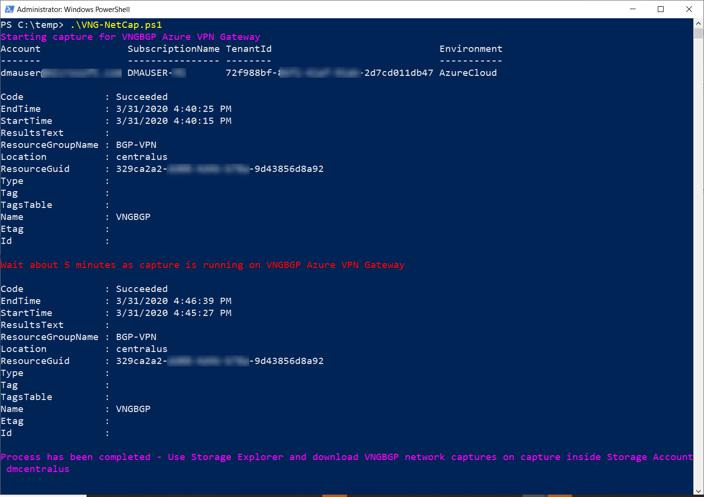

# Azure Virtual Network Gateway Packet Capture (Powershell GUI)

## Introduction

This is Powershell script the leverages AzVirtualnetworkGatewayPacketCapture cmdlets to facilitate network packet captures on Azure Gateways. More information: [Configure packet captures for VPN gateways](https://docs.microsoft.com/en-us/azure/vpn-gateway/packet-capture). The biggest adavantage of this feature is it allows customers have now to obtain their own Azure VPN Gateway network captures without open a support ticket.

  **Note:** This only works for Azure VPN Gateways and are not applicable for other types of Azure Gateways such as ExpressRoute or Application Gateway.

## Prerequisites

- Create a storage account and container on the same Resource Group as your Virtual Network Gateway. For example: capture container under Storage Account dmausercs as shown:

    

- It runs only over Powershell 5.1 at this time.
- Make sure Azure Powershell cmdlets are properly installed (see: http://aka.ms/azps)
- See roadmap at bottom with new features to be added.

## Powershell Script:

You can download VNG-NetCap.ps1 or copy and paste script as shown:

<pre lang="...">

<#Pre-requesits:
- Install Azure Powershell Module (http://aka.ms/azps)
- For now only Powershell 5.1 supported.
- Create a Storage Account and Container in the same Resource Group as VPN Gateway.
#>

Connect-AzAccount
$SubID = (Get-AzSubscription | Out-GridView -Title "Select Subscription ..."-PassThru )
Set-AzContext -Subscription $SubID.name
$RG = (Get-AzResourceGroup | Out-GridView -Title "Select an Azure Resource Group ..." -PassThru ).ResourceGroupName
$VNG = (Get-AzVirtualNetworkGateway -ResourceGroupName $RG).Name | Out-GridView -Title "Select an Azure VNET Gateway ..." -PassThru
$storeName = (Get-AzStorageAccount -ResourceGroupName $RG | Out-GridView -Title "Select an Azure Storage Account ..." -PassThru ).StorageAccountName
$key = Get-AzStorageAccountKey -ResourceGroupName $RG -Name $storeName
$context = New-AzStorageContext -StorageAccountName $storeName -StorageAccountKey $key[0].Value
$containerName = (Get-AzStorageContainer -Context $context | Out-GridView -Title "Select Container Name..." -PassThru ).Name
$now=get-date
$sasurl = New-AzStorageContainerSASToken -Name $containerName -Context $context -Permission "rwd" -StartTime $now.AddHours(-1) -ExpiryTime $now.AddDays(1) -FullUri
$minutes = 5, 7, 15, 20 | Out-Gridview -Title "How many Minutes network capture should run?" -OutputMode Single
$seconds = 60*$minutes

#Start packet capture for a VPN gateway
Write-Host "Starting capture for $VNG Azure VPN Gateway" -ForegroundColor Magenta
Start-AzVirtualnetworkGatewayPacketCapture -ResourceGroupName $RG -Name $VNG
Start-Sleep -Seconds $seconds
Write-Host "Wait about $minutes minutes as capture is running on $VNG Azure VPN Gateway" -ForegroundColor Red
#Stop packet capture for a VPN gateway
Stop-AzVirtualNetworkGatewayPacketCapture -ResourceGroupName $RG -Name $VNG -SasUrl $sasurl
#Script finished
Write-Host "Process has been completed - Use Storage Explorer and download $VNG network captures on $containerName inside Storage Account $storeName" -ForegroundColor Magenta

</pre>

Sample output when script runs:

## How to retrieve and review generated captures

Use Azure Storage Explorer to retreive the captures. Navegate on container and capture should be inside folder with date/time (UTC) as shown:

**Note** that Azure VPN Gateway always runs over two instances. In case you have Active/Passive you may see IPSec traffic only in one of the instances while when you have Active/Active configuration both of them will have IPSec traffic inside.

Captures are saved on pcap format and you can use Wireshark to review them, here is an example:

- Capture above show typical IPSec IKEv2 connection establishment:
    - Phase I (Main Mode - first two frames). 
    - Phase II (Quick Mode - third and fourth frames) 
    - Data being exchanged between VPN Gateways over IPSEC ESP (NAT-T - UDP 4500 - Last four frames).

## Roadmap

- Add support to Powershell Core 6.0.
- Add option to create Storage Account + Container.
- Add option to select Azure VPN Gateway to start captures per Connections. That will be useful for narrow down capture only for a specific Site-to-Site VPN Connection.
- Add option to include filters.
