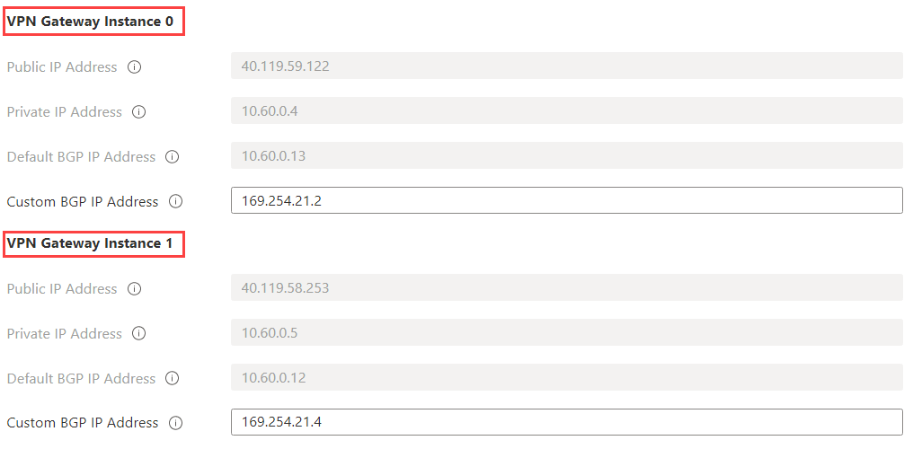
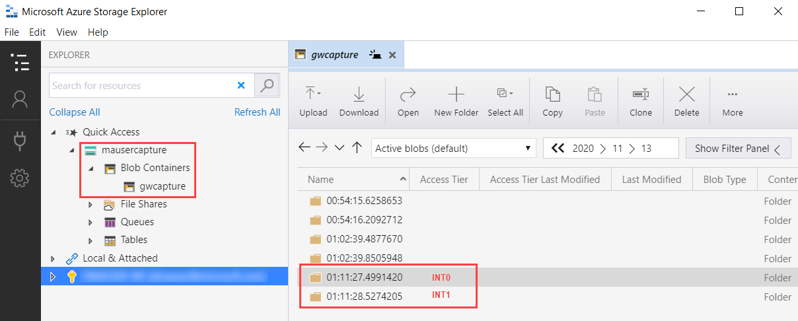

# Azure Virtual WAN VPN Gateway Packet Capture

## Introduction

Visibility is always good when you want to understand what is happening or troubleshoot issues over Site-to-Site VPN connections. In this post, I am going over how to leverage a Powershell script that uses [Start-AzVpnGatewayPacketCapture](https://docs.microsoft.com/en-us/powershell/module/az.network/start-azvpngatewaypacketcapture?view=azps-5.0.0) and [Stop-AzVpnGatewayPacketCapture](https://docs.microsoft.com/en-us/powershell/module/az.network/stop-azvpngatewaypacketcapture?view=azps-5.0.0) cmdlets to facilitate network packet captures on Azure Virtual WAN (vWAN) VPN Gateways. The script below also creates a SAS URL to be used during the process of saving VPN Gateway captures to a blob storage account.

**Note:** This script only works for Azure Virtual Wan VPN Gateways in case you want to capture over Virtual Network VPN Gateway please the references:

- [Azure Virtual Network Gateway Packet Capture](https://github.com/dmauser/Lab/tree/master/AZVPNGW/PacketCapture)
- [Configure packet captures for VPN gateways](https://docs.microsoft.com/en-us/azure/vpn-gateway/packet-capture)

## PowerShell script

Script is available inside the repository as PacketCapture.ps1 or can save the content listed below and make modifications based on your needs based on instructions/comments added inside the script.

### Prerequisites

1) At least Azure Az Module 5.0.0
2) A storage account and blog container name.
3) Ensure you are properly logged in your subscription where vWAN Gateways and Storage Account with container are present. You can validate that by using:

```powershell
Add-AzAccount #Logon on your Azure
Get-AzContext # Check you have correct Azure Subscription
Set-AzContext -Subscription <Subscription Name> # Set appropriate Subscription
```

Also script below requires you to specify five required parameters:

- **vWANGWName** = vWAN VPN Gateway Name
- **vWANGWRG** = vWAN Resource Group Name
- **StgName** = Storage Account Name
- **StgRG** = Storage Account Resource Group Name
- **StgContainerName** = Blog storage container name

**Note:** Storage account specified can be on any region but it is recommended specify it on the same region as vWAN VPN Gateway to avoid inter region data transfer fees.

### Content

```PowerShell
Param(
    [Parameter(Mandatory=$true,
    HelpMessage="Add ")]
    [String]
    $vWANGWName,

    [Parameter(Mandatory=$true,
    HelpMessage="Add vWAN Resource Group Name")]
    [String]
    $vWANGWRG,

    [Parameter(Mandatory=$true,
    HelpMessage="Add Storage Account Name")]
    [String]
    $StgName,

    [Parameter(Mandatory=$true,
    HelpMessage="Add Storage Account Resource Group Name")]
    [String]
    $StgRG,

    [Parameter(Mandatory=$true,
    HelpMessage="Add Storage Account blob container Name")]
    [String]
    $StgContainerName
)

# Variables that can be adjusted based in your needs.
# Filter1 gets inner and outer IPSec Tunnel traffic (Default filter used by this script).
$Filter1 = "{`"TracingFlags`": 11,`"MaxPacketBufferSize`": 120,`"MaxFileSize`": 500,`"Filters`" :[{`"CaptureSingleDirectionTrafficOnly`": false}]}" 
# Filter2 shows how to filter between IPs or Subnets.
$Filter2 = "{`"TracingFlags`": 11,`"MaxPacketBufferSize`": 120,`"MaxFileSize`": 500,`"Filters`" :[{`"SourceSubnets`":[`"10.60.4.4/32`",`"10.200.1.5/32`"],`"DestinationSubnets`":[`"10.60.4.4/32`",`"10.200.1.5/32`"],`"CaptureSingleDirectionTrafficOnly`": false}]}" # This filter gets inner and outer IPSec Tunnel traffic.
<# Few notes about filters: 
1) MaxPacketBufferSize it takes first 120 bytes. You can change it to 1500 to get full packet size in case you need to investigate the payload.
2) MaxFileSize is 500 MB.
#>
$startTime = Get-Date
$EndTime = $startTime.AddDays(1)
$ctx = (Get-AzStorageAccount -Name $StgName -ResourceGroupName $StgRG).Context
$SAStokenURL = New-AzStorageContainerSASToken  -Context $ctx -Container $StgContainerName -Permission rwd -ExpiryTime $EndTime -FullUri

# Get full VPN Gateway Capture
## Start Packet Capture
Write-Host "Please wait, starting VPN Gateway packet capture..." -ForegroundColor Yellow
Start-AzVpnGatewayPacketCapture -ResourceGroupName $vWANGWRG -Name $vWANGWName -FilterData $Filter1

## Stop Packet Capture
Write-Host -NoNewLine 'Reproduce your issue and press any key to stop to capture...' -ForegroundColor Yellow;
$null = $Host.UI.RawUI.ReadKey('NoEcho,IncludeKeyDown');
Write-Host ""
Write-Host "Please wait, stopping VPN Gateway packet capture..." -ForegroundColor Red

Stop-AzVpnGatewayPacketCapture -ResourceGroupName $vWANGWRG -Name $vWANGWName -SasUrl $SAStokenURL

## Retrieve your Packet Captures
Write-Host "Retrieve packet captures using Storage Explorer over:" -ForegroundColor Yellow
Write-Host "Storage account:" $StgName
Write-Host "Blob container :" $StgContainerName
```

### Example


## Reviewing Captures

One of the points to keep in mind is vWAN VPN Gateways are Active-Active by design as shown:



Therefore you have to download two captures from each respective VPN Gateway instance. In Storage Explorer will look like as shown below, where will have folder for each instance (INT0 and INT1) with the folder being a time stamp when capture is saved inside the Blob storage container gwcapture:



In the example below, during the capture I ran 10 pings from connected VNET VM (10.60.4.4) to a remote VPN VM (10.200.1.4):

### Scenario 1: Single Tunnel traffic

Remove VPN device is only configured to INT1 and in this case even after retrieve both instances captures ICMP pings only show up on instance 1 (INT1) as shown below:


### Scenario 2: Active-Active tunnel traffic (BGP)

In this second scenario, we have an active-active tunnel (two IPSec tunnels) to both vWAN gateway instances (INT0 and INT1) using BGP. You should expect traffic split between both tunnels because that is an expected behavior, see example below of the same ICMP ping above but now using both tunnels:


### REST API Example

There's no CLI to initiate vWAN VPN Gateway Network Captures at the time this post got created. In the example below, you can use REST API for the same process:

**Start VPN Gateway packet capture:**

Replace **{{SubscriptionID}}, {{resourceGroupName}} and {{vpnGatewayName}}** with your information. Also you can change **filterData** below to your needs, check [Packet capture filtering capabilities](https://docs.microsoft.com/en-us/azure/vpn-gateway/packet-capture#vpn-gateway-packet-capture-filtering-capabilities) on how you can customize it.
```RestAPI
POST https://management.azure.com/subscriptions/{{SubscriptionID}}/resourceGroups/{{resourceGroupName}}/providers/Microsoft.Network/{{vpnGatewayName}}/startPacketCapture?api-version=2020-05-01

{
  "filterData": "{'TracingFlags': 11,'MaxPacketBufferSize': 120,'MaxFileSize': 500,'Filters': [{'CaptureSingleDirectionTrafficOnly': false}]}"
}
```

**Stop VPN Gateway Packet Capture:**

Replace **{{SubscriptionID}}, {{resourceGroupName}} and {{vpnGatewayName}}** with your information. Specify a **sasUrl** to save packet captures on a blob storage account.

```RestAPI
POST https://management.azure.com/subscriptions/{{SubscriptionID}}/resourceGroups/{{resourceGroupName}}/providers/Microsoft.Network/{{vpnGatewayName}}/stopPacketCapture?api-version=2020-05-01

{
  "sasUrl": "Add your SAS URL to save packet capture"
}
```
